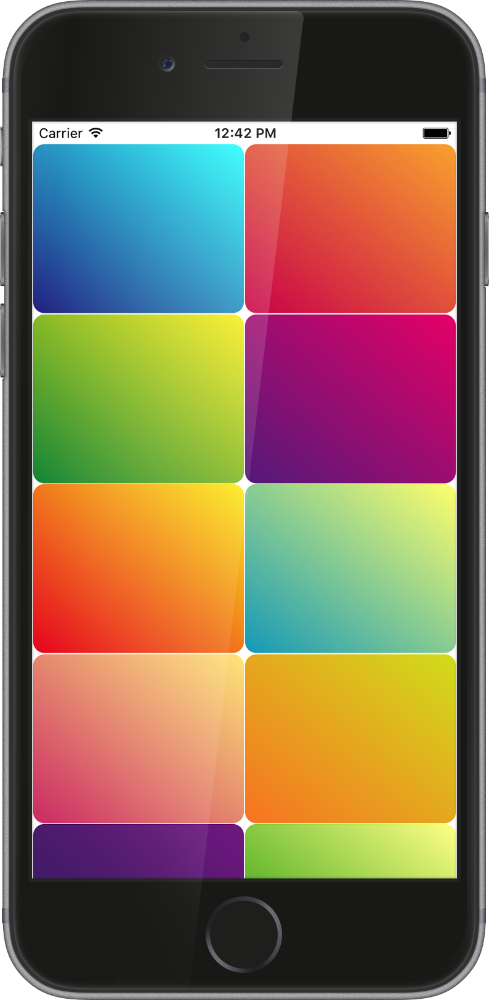
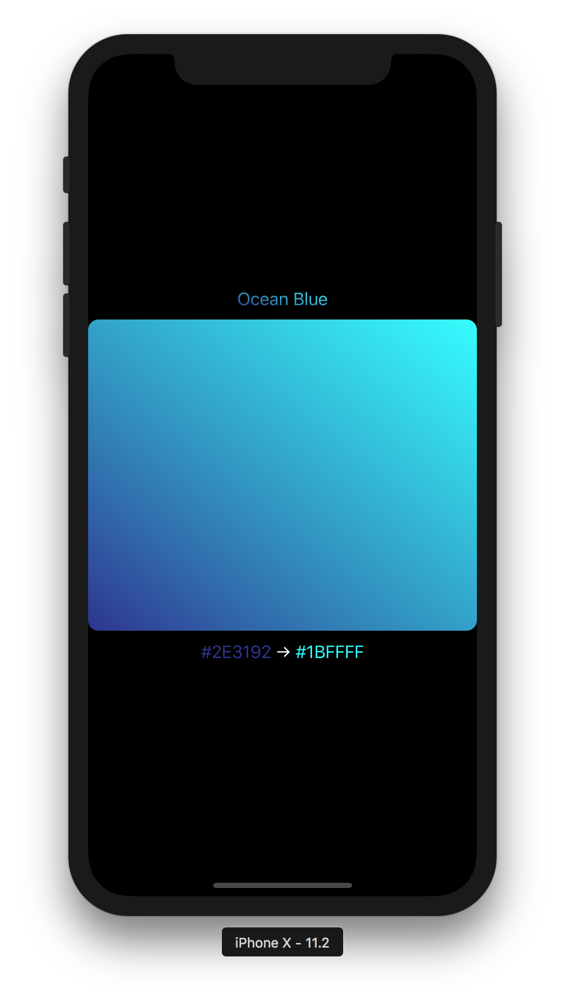
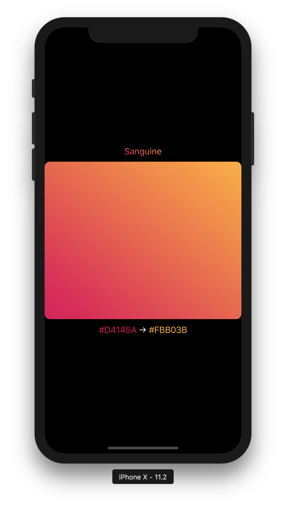
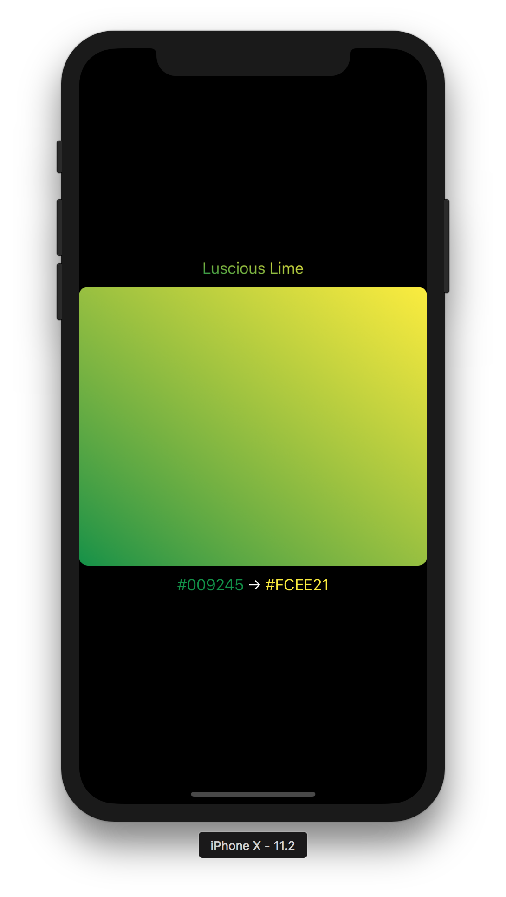
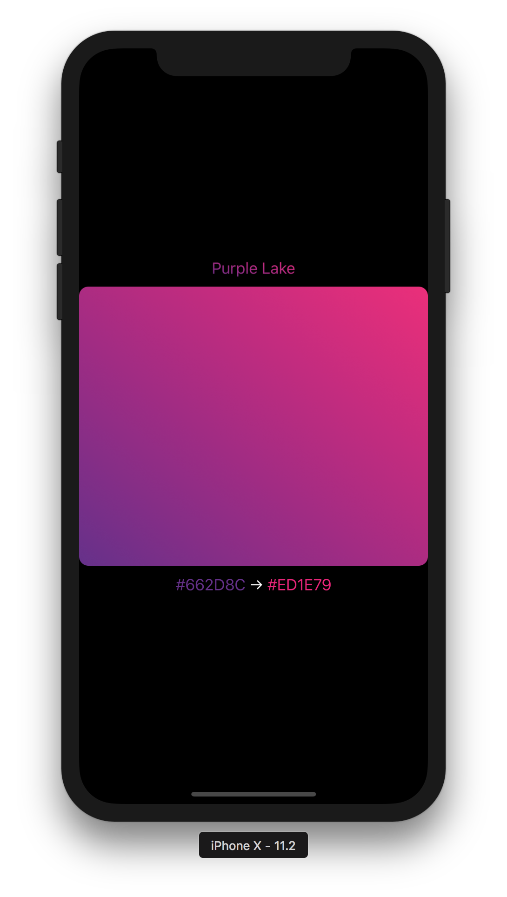

<p align="center">
<a href="https://github.com/dqhieu/UIGradient"></a>
<br><br>
<a href="https://github.com/dqhieu/UIGradient"></a>


   
</p>

## Installation
UIGradient is now available on CocoaPods. Simply add the following to your project Podfile, and you'll be good to go.
```ruby
pod 'UIGradient'
```

## Usage
### GradientLayer
Create a GradientLayer then add it to your view's
```swift
public extension UIView {

    func addGradientWithDirection(_ direction: GradientDirection, colors: [UIColor], cornerRadius: CGFloat = 0, locations: [Double]? = nil)

    func addGradient(_ gradientLayer: GradientLayer, cornerRadius: CGFloat = 0)
	
}
```
Example
```swift
let gradient = GradientLayer(direction: GradientDirection, colors: [UIColor])
view.addGradient(gradient)
```
UIGradient supports those directions below:
```swift
public enum GradientDirection {
    case topToBottom // top to bottom
    case bottomToTop // bottom to top
    case leftToRight // left to right
    case rightToLeft // right to left
    case topLeftToBottomRight // top left to bottom right
    case topRightToBottomLeft // top right to bottom left
    case bottomLeftToTopRight // bottom left to top right
    case bottomRightToTopLeft // bottom right to top left
}
```

You can also create a GradientLayer clone instance using this function:
```swift
open class GradientLayer: CAGradientLayer {
    ...
    public final func clone() -> GradientLayer
    ...
}
```

### Gradient color
UIGradient allows you create gradient color
```swift
public extension UIColor {

    static func fromGradient(_ gradient: GradientLayer, frame: CGRect, cornerRadius: CGFloat = 0) -> UIColor?
	
    static func fromGradientWithDirection(_ direction: GradientDirection, frame: CGRect, colors: [UIColor], cornerRadius: CGFloat = 0, locations: [Double]? = nil) -> UIColor?
	
}
```
Example
```swift
let view1 = UIView(frame: frame)
view1.backgroundColor = UIColor.fromGradientWithDirection(.topToBottom, frame: frame, colors: [UIColor.blue, UIColor.green])
//view1.backgroundColor = UIColor.fromGradient(gradient, frame: frame)
```
```swift
let label = UILabel(frame: frame)
label.text = "some text"
label.textColor = UIColor.fromGradient(gradient, frame: frame)
```

### Gradient image
UIGradient also allows you create gradient image
```swift
public extension UIImage {

    static func fromGradient(_ gradient: GradientLayer, frame: CGRect, cornerRadius: CGFloat = 0) -> UIImage?
	
    static func fromGradientWithDirection(_ direction: GradientDirection, frame: CGRect, colors: [UIColor], cornerRadius: CGFloat = 0, locations: [Double]? = nil) -> UIImage?
	
}
```
Example
```swift
let imageView = UIImageView(frame: frame)
imageView.image = UIImage.fromGradientWithDirection(.bottomLeftToTopRight, frame: frame, colors: [UIColor.blue, UIColor.green])
```

## Gradient library
UIGradient was inspired by [@lukedesigner](https://twitter.com/lukedesigner). I created 24 gradients based on his [website](http://www.gradients.io) and make them static variables of GradientLayer so everyone can use those gradients for their projects.
```swift
let oceanBlueGradient 		= GradientLayer.oceanBlue
let sanguineGradient  		= GradientLayer.sanguine
let lusciousLimeGradient 	= GradientLayer.lusciousLime
let purpleLakeGradient 		= GradientLayer.purpleLake
...
```
<p align="center">

</p>
You can explore them in my example project.

## Author
UIGradient was created by **Đinh Quang Hiếu** (dqhieu13@gmail.com) in 2017 using Swift. If you found any problem please create issue or pull request to help me improve this open source project. Thanks!

## License
UIGradient is released and distributed under the terms and conditions of the MIT license.
